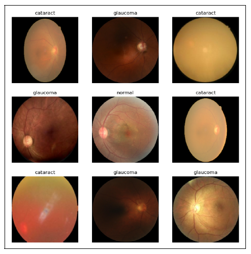
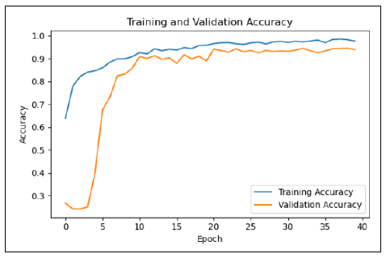
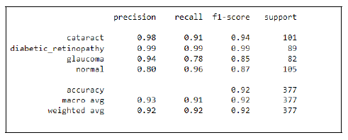

##  Eye Disease Classification: An Effective Analysis for a Better Diagnosis

### Project Summary:

This project addresses the global health issue of eye diseases by leveraging retinal scans and advanced deep learning models to provide accurate and timely diagnosis, aiming to enhance patient care and raise awareness about eye health.

### What it does: 

The project's primary objective is to classify retinal images into categories such as Normal, Diabetic Retinopathy, Cataract, and Glaucoma using state-of-the-art deep learning models, with a focus on EfficientNETB3. It analyzes the performance of different models, including a simple CNN and Resnet-18, and evaluates their accuracy, precision, recall, and F1-scores.

### Technologies Used: 

The project employs deep learning technologies, specifically EfficientNETB3, Resnet-18, and a simple CNN, for image classification. Metrics like accuracy, precision, recall, and F1-scores are used for evaluation.

### Results:

EfficientNETB3 outperformed other models with a 92% accuracy rate and strong precision and recall across classifications. It showed the least variance and overfitting. The project demonstrates the potential of deep learning in improving the diagnosis of eye diseases, emphasizing the importance of accuracy in medical image classification.

